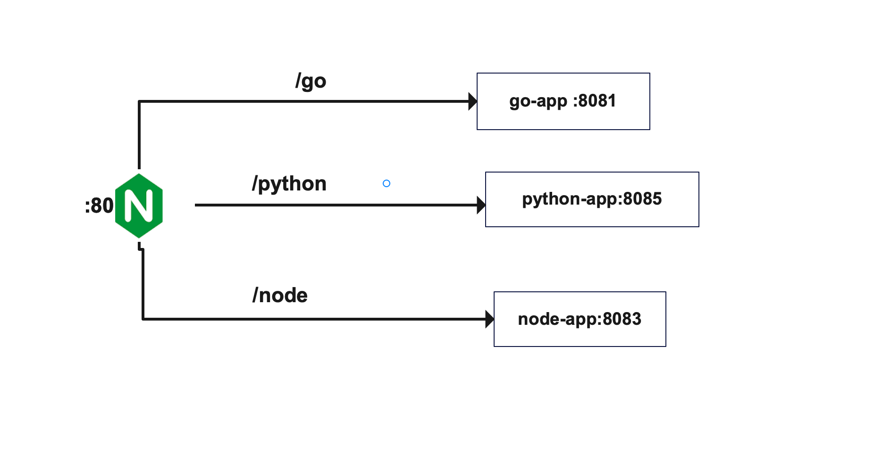
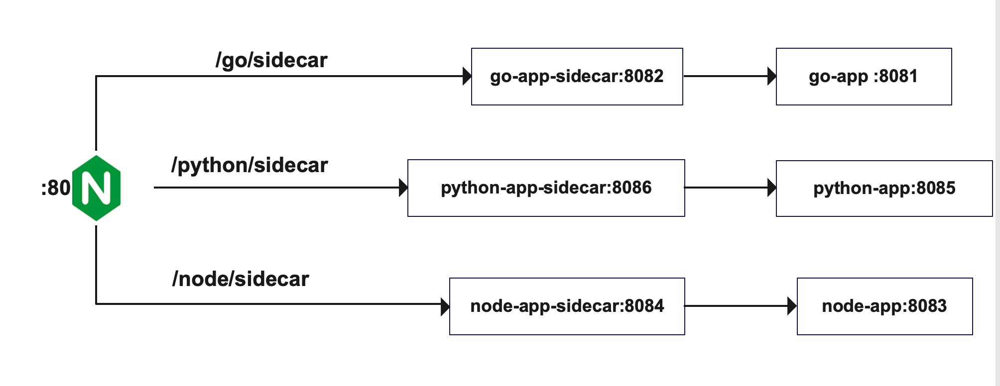

#### simple sidecar demonstration

Application consists of three services written in golang, python and nodejs.
Each of the services has a registered route `/customers` prefixed by the language they are written in. these routes return a xml response with a list of customer objects.



Available Routes:\
**_/go/customers_**\
**_/node/customers_**\
**_/python/customers_**

The above routes yields xml response like so

```
<Customers>
    <Customer>
        <Id>825ccc8cd87b49bbb1990560fc1f880c</Id>
        <FirstName>Bud</FirstName>
        <LastName>Mraz</LastName>
        <Address>South Ima, Uzbekistan</Address>
        <Phone>1-470-660-1388</Phone>
        <CreatedAt>2013-01-28T05:46:25Z</CreatedAt>
    </Customer>
    <Customer>
        <Id>3cb2c43f11614191961cdccaabed9833</Id>
        <FirstName>Otilia</FirstName>
        <LastName>Sawayn</LastName>
        <Address>Damiontown, United Arab Emirates</Address>
        <Phone>+1.660.682.8920</Phone>
        <CreatedAt>1982-04-29T09:24:42Z</CreatedAt>
    </Customer>
    ...
</Customers>
```

Now I want to add a logic that will reply with the json or xml response as specified in the routes.

`/go/customers.xml` will yield xml response\
`/go/customers.json` will yield json response

One solution could be to write this logic inside every services. since they are written in different languages, we cannot share the logics. but we could create a service whose sole task would be to return the desired response. and we could use this service as a sidecar to extend the functionalities of each services.

we can see on the `/deploy/docker-compose.yaml` file that all the sidecars runs on the same image, that is because same logic is used by all the services to add this feature.



Available Routes:\
**_/go/sidecar/customers.json_**\
**_/go/sidecar/customers.xml_**\
**_/node/sidecar/customers.json_**\
**_/node/sidecar/customers.xml_**\
**_/python/sidecar/customers.json_**\
**_/python/sidecar/customers.xml_**

The above routes will return\
XML response:

```
<Customers>
    <Customer>
        <Id>825ccc8cd87b49bbb1990560fc1f880c</Id>
        <FirstName>Bud</FirstName>
        <LastName>Mraz</LastName>
        <Address>South Ima, Uzbekistan</Address>
        <Phone>1-470-660-1388</Phone>
        <CreatedAt>2013-01-28T05:46:25Z</CreatedAt>
    </Customer>
    <Customer>
        <Id>3cb2c43f11614191961cdccaabed9833</Id>
        <FirstName>Otilia</FirstName>
        <LastName>Sawayn</LastName>
        <Address>Damiontown, United Arab Emirates</Address>
        <Phone>+1.660.682.8920</Phone>
        <CreatedAt>1982-04-29T09:24:42Z</CreatedAt>
    </Customer>
    ...
</Customers>
```

JSON Response

```
{
    customers:{
        customer:
            [
                {
                    Id: "3452549",
                    FirstName: "Mercedes",
                    MiddleName: "Sage",
                    LastName: "Beatty",
                    Phone: "+977-989-653-5123",
                    CreatedAt: "2021-11-12T05:04:00.963Z"
                },
                {
                    Id: "8174175",
                    FirstName: "Ellen",
                    MiddleName: "Billie",
                    LastName: "Rempel",
                    Phone: "+977-904-953-5830",
                    CreatedAt: "2022-01-29T18:42:44.087Z"
                },
                {
                    Id: "6107597",
                    FirstName: "Cydney",
                    MiddleName: "Ryan",
                    LastName: "Konopelski",
                    Phone: "+977-924-355-9087",
                    CreatedAt: "2022-09-24T03:48:41.441Z"
                },
                {
                    Id: "9506459",
                    FirstName: "Dexter",
                    MiddleName: "Rowan",
                    LastName: "Maggio",
                    Phone: "+977-941-600-7745",
                    CreatedAt: "2022-05-01T17:13:32.174Z"
                },
            ]
        }
}
```

Old routes are also available, they return xml responses:\
**_/go/customers_**\
**_/node/customers_**\
**_/python/customers_**
